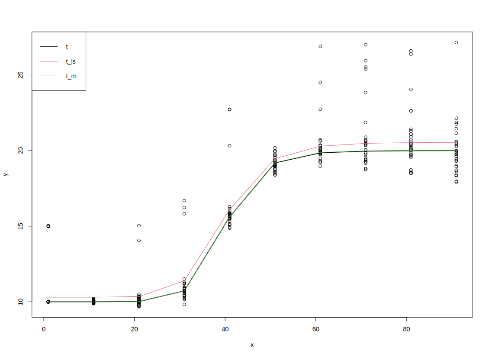

# drob

An R package that provides the `drob` function (alongside other minor utilities) to compute robust estimates for the parameters of potentially nonlinear and heteroscedastic dose-response models, using a 3-step algorithm in the spirit of MM-estimation.

You can install it directly from this repository by taking advantage of [devtools](https://github.com/r-lib/devtools)' `install_github` function:

```R
devtools::install_github("memeplex/drob")
```

For further details, please refer to the [reference documentation](drob.pdf).

Here is a minimal example:

```R
set.seed(0)
t <- c(10, 10, 40, 20)
x <- rep(seq(1, 100, 10), each = 30)
n <- length(x)
cont <- runif(n) > 0.9
e <- rnorm(n, ifelse(cont, 5, 0), (x / 100) * ifelse(cont, 3, 1))
y <- fpl$fun(x, t) + e
est <- drob(x, y)
plot(x, y)
lines(x, fpl$fun(x, t), lwd = 2)
lines(x, fpl$fun(x, est$init$t), col = 2)
lines(x, fpl$fun(x, est$t), col = 3)
legend("topleft", legend = c("t", "t_ls", "t_m"), lty = rep(1, 3), col = 1:3)
```


